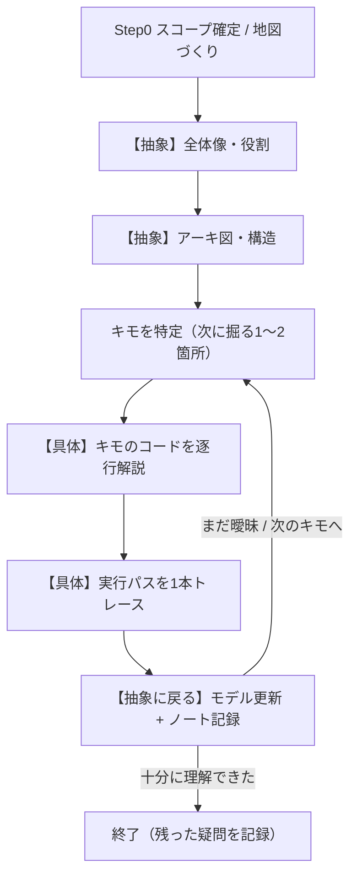
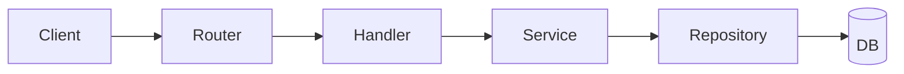

# コード理解練習（understand-code）

未知のコードを **「抽象 → 具体 → 抽象」のサイクル**で読み解き、理解を `.understanding/` の理解ノートに残しながら深めていくためのスキル。

- **進め方は解説型**: Codex が各層を読み解いて全体像・図・コード解説を提示する。ユーザーは読んで理解する。
- **ただし受け身で終わらせない**: 各層の区切りで一度止まり、読む間を作る。任意の「確認問題」で自分の理解を試せるようにする。
- **核心はサイクル**: 一度の通読で終わりにせず、抽象でモデルを立て→具体で裏を取り→抽象に戻ってモデルを更新する。1周ごとに解像度が上がる。理解ノートは対象ごとに継続し、再実行で追記して深掘りしていく。

引数: `ユーザーの依頼内容`

## なぜ抽象→具体のサイクルなのか

未知のコードを最初の行から読むと、文脈がないまま詳細に溺れる。代わりに **トップダウン**で進める:

1. **抽象**: まず「これは何で、どう組まれているか」の仮説（メンタルモデル）を立てる。実装詳細には踏み込まない。
2. **具体**: その仮説の「キモ」になる箇所だけを精読し、実コードで裏を取る。
3. **抽象に戻る**: 具体で分かったことでモデルを更新する。仮説が合っていたか・壊れたかを確認し、次に掘るキモを選ぶ。

これを回すたびに「全体像」と「細部」の往復で理解が編み上がる。1周で全部を理解しようとしない。



## 引数の解釈（スコープ確定）

`ユーザーの依頼内容` の先頭トークンを対象パス、`:` 以降（または残りの自然文）を「特に知りたいこと（フォーカス）」とみなす。

- **引数なし** → **リポジトリ全体**（カレントディレクトリ）。
- 先頭がディレクトリ → **モジュール / ディレクトリ**スコープ。
- 先頭がファイル（`path/to/file.py` や `file.py:func` / `file.py::func`） → **1ファイル / 関数**スコープ。
- `:` の後ろにフォーカスがあれば、サイクル中の優先度をそこに寄せる（例: `services/ : 認証はどこで効いている？`）。

判定できない / 該当パスが存在しない場合は、推測した対象を1行で示してユーザーに確認してから進む。

---

## Step 0: スコープ確定とオリエンテーション（地図づくり）

**まだ精読しない。全体の地形だけ掴む。**

1. 引数から対象スコープとフォーカスを決める（上記ルール）。
2. 地図を作るために、軽く眺める（`rg --files` / `rg` / `git ls-files` 等）:
   - ディレクトリツリー（深さ2〜3程度）、エントリポイント候補
   - マニフェスト（`pyproject.toml` / `package.json` / `go.mod` / `Cargo.toml` 等）と主要依存
   - `README` / `docs/` / `AGENTS.md`（あれば。プロダクトの意図が早く掴める）
3. 対象を1〜2行で確認する（例:「対象 = `src/api/` ディレクトリ、フォーカス = 認証フロー。これで進める？」）。明らかなら確認を待たず続行してよい。
4. 理解ノートを用意する（「理解ノート」セクション参照）。**同じ対象の既存ノートがあれば読み込み、新規サイクルとして追記更新する**（上書きしない）。

---

## サイクル本体（Step 1〜7 を必要なだけ繰り返す）

### Step 1【抽象】全体像・役割

「これは何をするものか／誰のためか／何に責任を持つか」を、**実装に踏み込まず**に説明する。リポジトリ全体ならプロダクトの目的と主要ユースケース、モジュールなら外部から見た責務と境界、ファイル/関数なら役割と呼び出し元・呼び出し先。
- まだ仮説で構わない。「確証」と「推測」を区別して書く（裏取りは具体層で行う）。

### Step 2【抽象】アーキテクチャ・構造（Mermaid図）

主要な構成要素とその関係・主要なデータ/制御フローを **Mermaid 図**で可視化する。ここも責務と名前のレベルに留め、行レベルには立ち入らない。



- スコープ別の粒度は「スコープ別の進め方」を参照。
- ここで一度止まり、ユーザーが読む間を作る。

### Step 3【抽象→具体の橋】キモの特定

全体像のうち、**次に具体へ降りる箇所を1〜2個に絞る**。広げすぎない。良いキモの選び方:
- エントリポイントから中心ロジックへ至る「背骨」の一本
- 設計の意図が最も濃く出ている中核の抽象（基底クラス / 中心の関数 / 状態管理）
- フォーカス指定があればそれに直結する箇所
- ユーザーが選べるよう、候補を「(a) ○○ (b) △△」と短く提示してもよい。

### Step 4【具体】キモのコードを逐行解説

選んだキモの**実コードを抜粋**し、ブロック/行単位で解説する。
- 何をしているか、**なぜそう書かれているか**、重要な型・契約、非自明な点・落とし穴。
- 参照は `file_path:line` 形式で（クリックできる）。確証はコードで裏を取り、根拠の `file:line` を残す。
- 抽象層で立てた仮説が合っていたか／崩れたかを明示する。

### Step 5【具体】実行パスを1本トレース

代表的な入力1つを選び、コードを通る経路を順に辿る（例:「リクエストが来てから応答を返すまで」「CLI 引数がパースされて副作用が起きるまで」）。具体のコードを Step 2 の抽象フローに**結び直す**のが狙い。

### Step 6【抽象に戻る】モデル更新 + 理解ノート記録

- 具体で分かったことを踏まえ、**全体像・アーキ図を更新**する（仮説の修正点を明示）。
- 理解ノートに、このサイクルの学びを追記する（次セクションのフォーマット）。
- **（任意）確認問題**: 理解を試せる問いを2〜3個提示する（例:「この関数が失敗したとき、エラーはどこで握られる？」）。ユーザーが答えれば軽くフィードバックし、答え／要点をノートに残す。答えなくても進める。

### Step 7【継続 or 終了】次に掘る箇所の選択

今わかっていること / まだ曖昧なことを1〜2行で整理し、次の選択肢を提示する:
- (a) 次のキモを深掘り（→ Step 3 へ戻る）
- (b) 全体像に立ち返って別の側面を見る（→ Step 1/2 へ）
- (c) ノートを確定して終了
十分に理解できたら、残った疑問をノートに記録して終了する。

---

## 理解ノートのフォーマット

- 配置: `.understanding/<対象スラッグ>-<YYYYMMDD>.md`
  - 対象スラッグ: リポジトリ全体=リポジトリ名 / ディレクトリ=パスの `/` を `-` に / ファイル=拡張子抜きファイル名（関数指定があれば `__<func>`）。
  - 日付は実行時に取得（`date +%Y%m%d`）。同じ対象を同日に再実行する場合は同じファイルに追記する。
  - 別日に同じ対象を続ける場合は、最新の既存ノートを読み込み、`更新:` 日付を足して同ファイルに新サイクルを追記する（上書きしない）。
- 上部セクション（全体像・アーキ図・責務）は**最新の理解で更新**、`掘ったコードと学び` は**サイクルごとに追記**していく。

```markdown
# 理解ノート: <対象>
作成: YYYY-MM-DD / 更新: YYYY-MM-DD
対象パス: <path>
フォーカス: <あれば>

## 全体像（自分の言葉）
<1〜数段落。実装に踏み込まない、噛み砕いた説明>

## アーキ図 (Mermaid)
```mermaid
...
```

## 主要コンポーネントの責務
| コンポーネント | 責務 | 主な依存 | 場所 |
| --- | --- | --- | --- |
| ... | ... | ... | `path:line` |

## 掘ったコードと学び
### サイクル1: <掘った箇所>（YYYY-MM-DD）
- 何が分かったか / なぜそう書かれているか
- 確証: `file:line` / 推測: <裏取りできていない点>
### サイクル2: ...

## 残った疑問 / 次に読む箇所
- [ ] <疑問。解けたらチェック＆答えを追記し、不要なら消す>

## （任意）理解度セルフチェック
- Q: ... / A: ...
```

---

## スコープ別の進め方

| スコープ | 全体像（Step1） | アーキ図（Step2） | キモ（Step3〜5） |
| --- | --- | --- | --- |
| **リポジトリ全体** | プロダクトの目的・主要ユースケース・利用者 | 主要モジュール / レイヤとデータフロー | エントリポイント→中心ドメインへ至る主要パス1本 |
| **モジュール / ディレクトリ** | このモジュールの責務と外部との境界（公開API） | 内部のファイル / クラス / 関数の関係 | 公開関数の代表1本をトレース |
| **1ファイル / 関数** | このファイル / 関数の役割・呼び出し元 / 呼び出し先 | 入出力・依存・データの流れ | 本体ロジックを逐行、分岐・エラー処理まで |

---

## 守ること

- **抽象層で実装詳細に踏み込まない**。コードの抜粋・逐行解説は具体層（Step4以降）でのみ行う。
- **1サイクルで掘るキモは1〜2個に絞る**。広げすぎず、深さ優先で。
- **「全部読む」をしない**。読む前に仮説を立て、必要な箇所だけ精読する。
- **読むだけ**。理解ノート（`.understanding/`）以外のファイルは作成・変更しない。コードは編集しない。
- **推測と確証を区別**して書く。コードで裏取りできたものは根拠の `file:line` を残す。
- 各層の終わりで一度止まり、ユーザーが読む間を作る。次に進むか・深掘りするか選べるようにする。
- ノートは対象ごとに継続。既存ノートがあれば追記更新し、上書きしない。
- 参照は `file_path:line` 形式で示す（クリックできる）。

## Environment / 参照

- 言語バージョン・依存・仮想環境などの前提は、各リポジトリの `AGENTS.md` / `docs/architecture.md` / `README` を参照する。
- `docs/`（dev-docs 構成）があれば、`product-requirements.md` / `functional-design.md` / `architecture.md` を全体像把握の近道として活用する。
